6# Study Library Dashboard - Page Navigation

This document provides a visual overview of how pages are connected in the application.

## Navigation Flowchart

```mermaid
flowchart TD
    subgraph Entry
        ROOT["/"] --> |Redirect| LOGIN[🔐 Login Page<br>/login]
    end

    subgraph Main["Main Application"]
        LOGIN --> |"Login Success"| LIBRARY[📚 Library Page<br>/library]
        
        LIBRARY --> |"Upload Button"| UPLOAD[📤 Upload Page<br>/upload]
        LIBRARY --> |"Flashcards Button"| DECK[🃏 Deck Overview<br>/deck]
        LIBRARY --> |"Summary Button"| ANALYSIS[📊 Analysis Page<br>/analysis]
        LIBRARY --> |"Settings Button"| SETTINGS[⚙️ Settings Page<br>/settings]
    end

    subgraph Study["Study Flow"]
        DECK --> |"Study Button"| FLASHCARDS[🎴 Flashcards Page<br>/flashcards]
        FLASHCARDS --> |"Back"| DECK
    end

    subgraph Upload["Upload Flow"]
        UPLOAD --> |"Submit File"| ANALYSIS
        UPLOAD --> |"Back"| LIBRARY
    end

    subgraph Settings["Settings & Help"]
        SETTINGS --> |"How It Works"| METHODOLOGY[💡 Methodology<br>/methodology]
        SETTINGS --> |"UI Components"| STATES[🎨 States Gallery<br>/states]
    end

    subgraph Back["Back Navigation"]
        DECK --> |"Back"| LIBRARY
        ANALYSIS --> |"Back"| LIBRARY
        SETTINGS --> |"Back"| LIBRARY
        METHODOLOGY --> |"Back"| LIBRARY
        STATES --> |"Back"| LIBRARY
        METHODOLOGY --> |"Try It"| UPLOAD
        STATES --> |"CTA"| UPLOAD
    end

    style LOGIN fill:#6366f1,color:#fff
    style LIBRARY fill:#8b5cf6,color:#fff
    style UPLOAD fill:#06b6d4,color:#fff
    style DECK fill:#f59e0b,color:#fff
    style FLASHCARDS fill:#f97316,color:#fff
    style ANALYSIS fill:#10b981,color:#fff
    style SETTINGS fill:#64748b,color:#fff
    style METHODOLOGY fill:#ec4899,color:#fff
    style STATES fill:#a855f7,color:#fff
```

## Simplified Navigation Map

## Page Details

| Page | Route | Purpose | Navigation From |
|------|-------|---------|-----------------|
| Login | `/login` | User authentication | Root redirect |
| Library | `/library` | Central hub, view study materials | Login |
| Upload | `/upload` | Upload new study materials | Library |
| Deck Overview | `/deck` | View flashcard decks | Library |
| Flashcards | `/flashcards` | Study flashcards | Deck Overview |
| Analysis | `/analysis` | View document analysis/summary | Library, Upload |
| Settings | `/settings` | App settings & preferences | Library |
| Methodology | `/methodology` | How the app works | Settings |
| States Gallery | `/states` | UI component showcase | Settings |

## Navigation Patterns

### Primary Flow (User Journey)
1. **Login** → **Library** → **Upload** → **Analysis**
2. **Login** → **Library** → **Deck Overview** → **Flashcards**

### Back Navigation
All pages (except Login) have a back button returning to **Library** (the central hub).

### Cross-Navigation
- **Methodology** and **States Gallery** can navigate to **Upload** via action buttons
- **Library** cards can navigate directly to **Analysis** or **Deck Overview**
